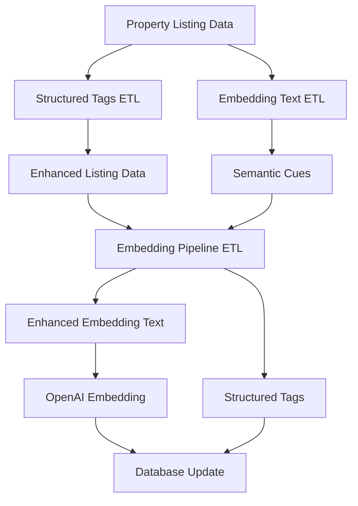

# ETL Pipeline: Complete Embedding Generation

This document describes the restructured ETL pipeline that combines embedding text generation and embedding calculation in one integrated process.

## 🏗️ Architecture Overview

The new ETL pipeline integrates three components:

1. **Structured Tags ETL** (`etl/struct_tags.py`) - Extracts structured tags from property data
2. **Embedding Text ETL** (`etl/embedding_text.py`) - Generates optimized text for embeddings
3. **Embedding Pipeline ETL** (`etl/embedding_pipeline.py`) - Combines both and calculates embeddings



## 📁 File Structure

```
etl/
├── struct_tags.py              # Structured tags extraction
├── embedding_text.py           # Embedding text generation
├── embedding_pipeline.py       # Complete pipeline (NEW)
└── config/
    ├── tags_struct_rules.yaml  # Structured tags configuration
    └── text_extraction_keywords.yaml  # Text extraction configuration

jobs/
├── update_embeddings_pipeline.py  # Database update job (NEW)
└── update_embedding_text.py       # Legacy text-only job

scripts/
└── supabase_manager.py        # Database operations (NEW)

test_etl_pipeline.py           # Test script (NEW)
```

## 🚀 Quick Start

### 1. Test the Pipeline

```bash
# Test with sample data
python test_etl_pipeline.py

# Test individual components
python etl/struct_tags.py
python etl/embedding_text.py
python etl/embedding_pipeline.py
```

### 2. Update Database (Dry Run)

```bash
# Test the job without making changes
python jobs/update_embeddings_pipeline.py --dry-run --limit 5

# Run with verbose logging
python jobs/update_embeddings_pipeline.py --dry-run --verbose --batch-size 5
```

### 3. Update Database (Production)

```bash
# Update all listings
python jobs/update_embeddings_pipeline.py

# Update with custom batch size
python jobs/update_embeddings_pipeline.py --batch-size 20

# Update limited number
python jobs/update_embeddings_pipeline.py --limit 100
```

## 🔧 Pipeline Components

### 1. Structured Tags ETL (`struct_tags.py`)

**Purpose**: Extracts structured tags from property data using rule-based logic

**Input**: Property listing with structured fields
```python
{
    'facing': 'S',
    'distance_to_metro_m': 500,
    'has_parking_lot': True,
    'year_renovated': 2021,
    'school_rating': 9,
    # ... other fields
}
```

**Output**: List of structured tags
```python
[
    {'tag': 'south_facing', 'evidence': 'Property faces south'},
    {'tag': 'walk_to_metro', 'evidence': 'Within 500m of metro station'},
    {'tag': 'parking_available', 'evidence': 'Parking available'},
    # ... more tags
]
```

**Rules**: 15 different rule categories including:
- Facing direction (N, S, E, W)
- Transit accessibility (≤600m to metro)
- Parking availability
- Renovation recency (≥2020)
- School quality (≥8/10)
- Safety (crime index ≤0.3)
- Property features (yard, amenities)
- Size categories (compact, spacious, luxury)

### 2. Embedding Text ETL (`embedding_text.py`)

**Purpose**: Generates optimized text for embedding generation

**Input**: Property listing with title, description, and structured data

**Output**: Structured text string (max 500 chars)
```
TITLE: Beautiful South-Facing Apartment with Balcony | 
FACTS: Apartment with 2 bedrooms and 2 bathrooms; Located in San Francisco, CA; 
Neighborhood: Downtown; Amenities: WiFi, Balcony, Parking | 
TAGS: parking_available, near_park, good_light, modern, good_school, safe_area, 
walk_to_transit, renovated_recent, south_facing, balcony | 
DESCRIPTION: This stunning apartment features a south-facing living room...
```

**Features**:
- **Semantic Cue Extraction**: 50+ positive keywords, 9 negative keywords
- **Context Rules**: Pattern matching with conditional logic
- **Structured Assembly**: TITLE | FACTS | TAGS | DESCRIPTION format
- **Length Management**: Ensures ≤500 characters for efficiency

### 3. Embedding Pipeline ETL (`embedding_pipeline.py`) - NEW

**Purpose**: Complete pipeline that combines all components and calculates embeddings

**Process**:
1. **Enhance Data**: Add structured tags to listing data
2. **Generate Text**: Create enhanced embedding text with semantic cues
3. **Calculate Embedding**: Use OpenAI text-embedding-3-small (1536 dimensions)
4. **Format Output**: Prepare database update data

**Output**: Tuple of (embedding_text, embedding_vector, tag_objects)

## 🗄️ Database Schema

The pipeline updates three fields in the `listings_v2` table:

```sql
-- Embedding text (optimized for semantic search)
embedding_text TEXT

-- Vector embedding (1536 dimensions)
embedding vector(1536)

-- Structured tags (JSONB array)
tags JSONB[]
```

### Example Database Update

```python
update_data = {
    'embedding_text': 'TITLE: Beautiful South-Facing Apartment...',
    'embedding': '[0.123, -0.456, 0.789, ...]',  # 1536 dimensions
    'tags': [
        {
            'tag': 'south_facing',
            'evidence': 'Property faces south',
            'source': 'structured',
            'rule_name': 'south_facing',
            'rule_version': '1.0.0'
        },
        # ... more tags
    ],
    'updated_at': 'now()'
}
```

## ⚙️ Configuration

### Structured Tags Rules (`config/tags_struct_rules.yaml`)

```yaml
rule_version: "1.0.0"
thresholds:
  distance_to_metro_m: 600
  school_rating: 8
  crime_index: 0.3
  year_renovated_recent: 2020

rules:
  - name: "south_facing"
    condition: "facing == 'S'"
    tag: "south_facing"
    evidence_template: "Property faces south"
```

### Text Extraction Keywords (`config/text_extraction_keywords.yaml`)

```yaml
positive_keywords:
  "south-facing": "south_facing"
  "steps to": "walk_to_transit"
  "renovated": "renovated_recent"
  "luxury": "luxury_property"

negative_keywords:
  "no parking": "no_parking"
  "no pets": "no_pets"

context_rules:
  - pattern: r"renovated.*(20[2-9][0-9])"
    condition: "int(match.group(1)) >= 2020"
    cue: "renovated_recent"
```

## 🔄 Job Execution

### Command Line Options

```bash
python jobs/update_embeddings_pipeline.py [OPTIONS]

Options:
  --dry-run          Run without making database changes
  --batch-size INT   Number of listings per batch (default: 10)
  --limit INT        Limit total listings to process
  --verbose          Enable detailed logging
```

### Job Features

- **Batch Processing**: Configurable batch sizes for rate limiting
- **Resume Capability**: Only processes listings without embeddings
- **Error Handling**: Continues processing on individual failures
- **Progress Tracking**: Real-time progress and statistics
- **Rate Limiting**: 2-second delays between API calls, 5-second delays between batches

### Example Job Run

```bash
$ python jobs/update_embeddings_pipeline.py --dry-run --limit 3 --verbose

🚀 Starting embedding pipeline update job...
   Dry run: True
   Batch size: 10
   Limit: 3

Found 3 listings needing embedding updates

📦 Processing batch 1 (3 listings)...
🔄 Processing batch of 3 listings...
✅ Processed listing test-001 (1/3)
✅ Processed listing test-002 (2/3)
✅ Processed listing test-003 (3/3)

✅ Batch 1 completed!
   Progress: 3/3 (100.0%)
   Batch results: 3 success, 0 failed

🎉 Embedding pipeline job completed!
📊 Final Statistics:
   Total processed: 3
   Successfully updated: 3
   Errors: 0
   Batches processed: 1
```

## 🧪 Testing

### Test Individual Components

```bash
# Test structured tags
python etl/struct_tags.py

# Test embedding text generation
python etl/embedding_text.py

# Test complete pipeline
python etl/embedding_pipeline.py
```

### Test Complete Pipeline

```bash
# Test with multiple sample listings
python test_etl_pipeline.py
```

### Expected Output

```
🚀 Testing ETL Pipeline with Multiple Listings
============================================================

📋 Processing Listing 1: Beautiful South-Facing Apartment with Balcony
--------------------------------------------------
📝 Embedding Text (500 chars):
   TITLE: Beautiful South-Facing Apartment with Balcony | FACTS: Apartment with 2 bedrooms and 2 bathrooms...
🔢 Embedding Vector:
   Dimensions: 1536
   Sample values: [-0.022662072, -0.04675687, 0.02851805]...
🏷️  Structured Tags (8 tags):
   • south_facing: Property faces south
   • walk_to_metro: Within 500m of metro station
   • parking_available: Parking available
   ... and 5 more tags
💾 Database Update Ready:
   ✅ embedding_text: 500 chars
   ✅ embedding: 1536 dimensions
   ✅ tags: 8 structured tags
```

## 🔍 Monitoring and Debugging

### Logging Levels

- **INFO**: General progress and statistics
- **DEBUG**: Detailed processing information
- **WARNING**: Non-critical issues
- **ERROR**: Critical failures

### Common Issues

1. **OpenAI API Rate Limits**
   - Solution: Increase delays between requests
   - Monitor: `--batch-size` and request delays

2. **Database Connection Issues**
   - Check: Environment variables (SUPABASE_URL, SUPABASE_SERVICE_ROLE_KEY)
   - Test: `scripts/supabase_manager.py`

3. **Missing Dependencies**
   - Install: `pip install -r requirements.txt`
   - Verify: All imports work in virtual environment

4. **Configuration Errors**
   - Check: YAML syntax in config files
   - Validate: Rule conditions and patterns

### Performance Optimization

- **Batch Size**: Adjust based on API rate limits (default: 10)
- **Delays**: Increase if hitting rate limits
- **Parallel Processing**: Future enhancement for large datasets
- **Caching**: Consider caching embeddings for repeated processing

## 🔮 Future Enhancements

1. **Parallel Processing**: Process multiple listings concurrently
2. **Incremental Updates**: Only update changed listings
3. **Embedding Caching**: Cache embeddings to avoid recalculation
4. **Quality Metrics**: Track embedding quality and similarity scores
5. **A/B Testing**: Compare different embedding strategies
6. **Custom Models**: Support for different embedding models

## 📊 Performance Metrics

### Typical Performance

- **Processing Speed**: ~2-3 seconds per listing (including API calls)
- **Batch Throughput**: ~20-30 listings per minute
- **Memory Usage**: ~50MB for typical batch processing
- **API Costs**: ~$0.0001 per embedding (text-embedding-3-small)

### Scalability

- **Small Dataset** (<1K listings): Single batch processing
- **Medium Dataset** (1K-10K listings): Multiple batches with delays
- **Large Dataset** (>10K listings): Consider parallel processing

## 🤝 Integration with Main Application

The new ETL pipeline integrates seamlessly with the existing RAG application:

1. **Search Enhancement**: Uses `embedding_text` field for better semantic search
2. **Tag Filtering**: Leverages structured tags for advanced filtering
3. **Quality Improvement**: Enhanced embeddings provide better search results
4. **Maintenance**: Automated updates keep embeddings current

The pipeline maintains backward compatibility while providing significant improvements in search quality and functionality.
